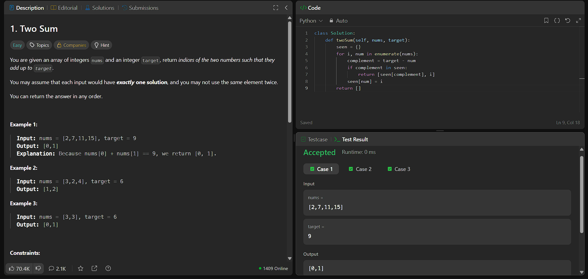

# LeetCode #1 — Two Sum

## 📝 Problem
🔗 [https://leetcode.com/problems/two-sum/](https://leetcode.com/problems/two-sum/)

Verilmiş `nums` massivi və `target` ədədi üçün, cəmi `target`-ə bərabər olan
iki ədədin indekslərini tapmaq lazımdır.

## ✅ Solution

```python
class Solution:
    def twoSum(self, nums, target):
        seen = {}
        for i, num in enumerate(nums):
            complement = target - num
            if complement in seen:
                return [seen[complement], i]
            seen[num] = i
        return []
```

## 💡 Yanaşma (Explanation)
Massiv bir dəfə gəzilir. Hər ədəd üçün, onunla birlikdə `target`-i verəcək
ədəd (`complement`) hesablanır və artıq gördüyümüz ədədləri saxlayan
`seen` adlı hash map-də axtarılır. Tapılarsa, cavab dərhal qaytarılır.
Tapılmazsa, cari ədəd öz indeksi ilə birlikdə `seen`-ə əlavə olunur.

Bu yanaşma brute-force (iki iç-içə loop, O(n²)) həllə nisbətən daha
effektivdir, çünki axtarışları O(1) vaxta endirir.

## 🗂 Data Structure
- **Hash Map (Python dict)** — daha əvvəl görülmüş ədədləri və onların
  indekslərini saxlamaq, sürətli axtarış (O(1)) üçün istifadə olunur.

## ⏱ Time Complexity
**O(n)** — massiv yalnız bir dəfə gəzilir, hər addımda dict axtarışı O(1) vaxt aparır.

## 💾 Space Complexity
**O(n)** — ən pis halda bütün elementlər `seen` dictionary-də saxlanıla bilər.

## 📸 Accepted Submission

